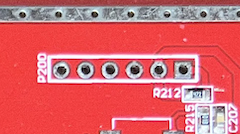
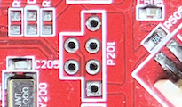
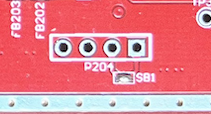

### LEDs

| LED    | PIN | GPIO |
|--------|-----|------|
| Blue   | 21  | RB12 |
| Green  | 20  | RB13 |
| Orange | 2   | RB15 |

### Buttons

| Button | PIN | GPIO  |
|--------|-----|-------|
| Reset  | 38  | RD0   |
| Reset  | 37  | RD11  |

### Motors

| Motor | PIN | GPIO |
|-------|-----|------|
| 1     | 22  | RD11 |
| 2     | 39  | RD4  |
| 3     | 41  | RD5  |
| 4     | 42  | RD6  |
| 5     | 43  | RD7  |
| 6     | 44  | RD9  |
| 7     | 46  | RD10 |

### Switches

| Switch | PIN | GPIO |
|--------|-----|------|
| 1      | 6   | RE3  |
| 2      | 5   | RE2  |
| 3      | 4   | RE1  |
| 4      | 3   | RE0  |
| 5      | 7   | RE4  |
| 6      | 10  | RE5  |
| 7      | 11  | RE6  |

### I/O

| Type                     | Name on board | Comment                                | Image            |
|--------------------------|---------------|----------------------------------------|------------------|
| ICSP (PicKit3 connector) | P200          | Pin1 is the square one (on the right)  |   |
| uart0                    | P201          | (From top to bottom) GND, RX, TX, 3.3V |  |
| uart1                    | P204          | (From left to right) RX, TX            |  |
