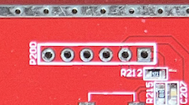
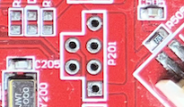
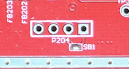

### LEDs

| LED    | PIN | GPIO |
|--------|-----|------|
| Blue   | 21  | RB12 |
| Green  | 20  | RB13 |
| Orange | 2   | RB15 |

### Buttons

| Button | PIN | GPIO  |
|--------|-----|-------|
| Reset  | 38  | RD0   |
| Reset  | 37  | RD11  |

### Motors

| Motor | PIN | GPIO |
|-------|-----|------|
| 1     | 22  | RD11 |
| 2     | 39  | RD4  |
| 3     | 41  | RD5  |
| 4     | 42  | RD6  |
| 5     | 43  | RD7  |
| 6     | 44  | RD9  |
| 7     | 46  | RD10 |

### Switches

| Switch | PIN | GPIO |
|--------|-----|------|
| 1      | 6   | RE3  |
| 2      | 5   | RE2  |
| 3      | 4   | RE1  |
| 4      | 3   | RE0  |
| 5      | 7   | RE4  |
| 6      | 10  | RE5  |
| 7      | 11  | RE6  |

### I/O

| Type                     | Name on board | Comment                                | Image            |
|--------------------------|---------------|----------------------------------------|------------------|
| ICSP (PicKit3 connector) | P200          | Pin1 is the square one (on the right)  |   |
| uart0                    | P201          | (From top to bottom) GND, RX, TX, 3.3V |  |
| uart1                    | P204          | (From left to right) RX, TX, CTS       |  |

!!! note "uart1 flow control (FlapOS 1.0.0 and earlier)"

    Up to FlapOS 1.0.0, `project.xml` configured uart1 with `handshake="True"`, so the module only transmitted BGAPI replies while its CTS line (the third hole of P204) was asserted. Since 1.0.1 the handshake is off, and this note only matters if you run an older build.

    On at least one SR-02A board that line floats when nothing drives it, with two consequences on 1.0.0:

    - **While debugging over P204**, the module receives commands but never answers, which looks exactly like a dead port.
    - **During normal operation**, the FlapOS application can hang while the Wi-Fi stack keeps running: the SSID still beacons, DHCP still hands out addresses, and the status led stays solid green, but the web server never answers. It reads as a network problem and is actually a stalled application. On that unit it was intermittent for weeks; a hand held an inch above the board, or the vibration of the flaps turning, was enough to trigger it.

    Either fix works: update to 1.0.1 or later, or solder a short link from the third hole to ground and leave it there. The author measured that line steady low on his own board, so this may only affect some units.
