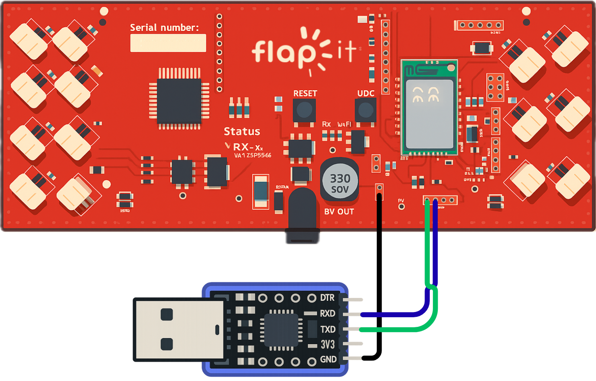

# Web Flasher

<div id="wiring" style="display: none;">
    
</div>

1. [Connect GND, RX and TX of your USB to TTL device to your Flapit](img/wiring.png){ #wiring-link .glightbox data-with="200px" }
2. Connect your USB to TTL device to your computer
3. Power on your Flapit and click "Install"

<br>
<select name="version">
    <option>Loading versions...</option>
</select>
<button id="installBtn" class="md-button md-button--primary">Install</button>

``` console { .console .no-copy #console style="display: none" }
```

!!! warning
    Use Chrome or another Chromium-based browser.
    Ensure no other app is using the serial port.

<!--- { .on-glb } -->
